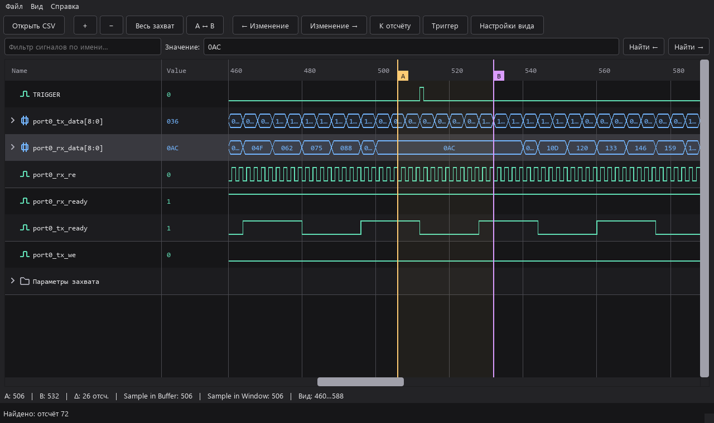

# RTLForge — ILA Waveform Reader

Настольный просмотрщик CSV-захватов Vivado ILA Hardware Manager на Python и
PySide6. Открывает данные локально и только для чтения. Шины можно раскрывать
на отдельные биты; диаграмму — прокручивать, масштабировать, искать переходы
и значения.



## Быстрый запуск на Windows

1. Установите Python 3.10 или новее.
2. Запустите `setup.bat` в папке проекта. Он создаст `.venv` и установит
   зависимости из `requirements.txt`.
3. Запустите `start.bat` и откройте свой CSV через **Ctrl+O** или перетащите
   файл в окно. Можно перетащить CSV прямо на `start.bat`.

Если в корне проекта лежит личный `waveform.csv`, приложение откроет его при
старте. Этот файл исключён из Git. Для запуска из терминала:

```powershell
.\.venv\Scripts\python.exe -m ila_viewer "C:\path\to\capture.csv"
```

Для работы с кодом:

```powershell
.\.venv\Scripts\python.exe -m unittest -v tests.test_waveform tests.test_extensions
.\.venv\Scripts\python.exe -m scripts.benchmark_waveform
```

Тесты используют искусственный захват из `tests/fixtures/`; личные данные
и созданные снимки экрана в репозиторий не входят.

## Возможности

- Шины, отдельные биты, группы, разделители, несколько тем и форматов Radix.
- Фильтр имён сохраняет состояние раскрытия шин; выбор сигналов доступен в
  колонках Name/Value и непосредственно на диаграмме через Ctrl+щелчок.
- Прокрутка и масштабирование больших захватов с дисковыми индексами переходов.
- Маркеры A/B, поиск значения и переход к изменениям сигнала.
- Возврат к последней папке при открытии CSV и кнопка «Обновить CSV» для повторной загрузки файла.
- При обновлении CSV сохраняются цвета совпавших сигналов и пересчитываются
  подсветки, условия которых остаются действительными.
- Общий или раздельный цвет и заливка шин/однобитных сигналов с настройками для каждой темы.
- Горизонтальная панель групп подсветки по логическому условию; у каждой группы
  свой цвет и прозрачность. Общая галочка скрывает все группы с сохранением
  индивидуальной видимости. Без B подсветка охватывает весь захват.
- Копирование выбранных сигналов и битов с отдельным Radix и диапазонами битов
  для каждого сигнала, добавлением сигналов прямо в редакторе, выбором
  уникальных значений и условием вида
  `tx_ready && tx_we && tx_data == FE`. Период выборки задаётся двумя точками
  на диаграмме во временном режиме и учитывает фазу от первой точки;
  отсчёт B является исключающей границей; без B копируется весь захват.
- Параметры интерфейса сохраняются между запусками; содержимое CSV и
  индивидуальное оформление сигналов не изменяются.

Подробные действия описаны в [руководстве пользователя](docs/USER_GUIDE.md).
Устройство кода и точки расширения — в [документе об архитектуре](docs/ARCHITECTURE.md).

## Структура проекта

| Путь | Назначение |
|---|---|
| `ila_viewer/` | Код приложения: чтение CSV, модель, интерфейс и экспорт |
| `ila_viewer/__main__.py` | Точка запуска через `python -m ila_viewer` |
| `tests/` | Тесты и искусственный CSV-захват |
| `docs/` | Руководство пользователя и архитектура |
| `scripts/benchmark_waveform.py` | Проверка на миллионе искусственных отсчётов |
| `setup.bat`, `start.bat` | Установка зависимостей и запуск на Windows |

## Лицензия

Copyright © 2026 Вячеслав Рудаков. Проект распространяется по
[Apache License 2.0](LICENSE); сведения об авторстве — в [NOTICE](NOTICE).
Зависимости PySide6 и NumPy устанавливаются отдельно и имеют собственные лицензии.
